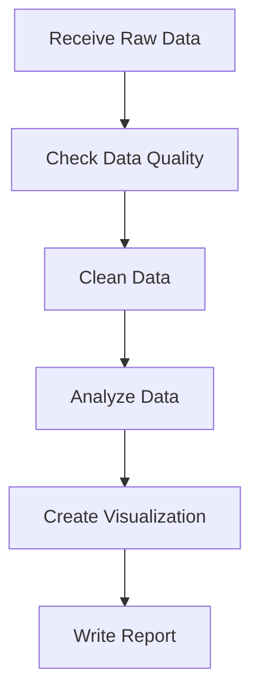

# EMRTS Internship Practice

This repository contains my learning notes and practice materials for the EMRTS data science internship.

## Topics

- GitHub
- Mermaid
- Python
- Medicaid
- Time Series Analysis

## Basic Data Science Workflow

